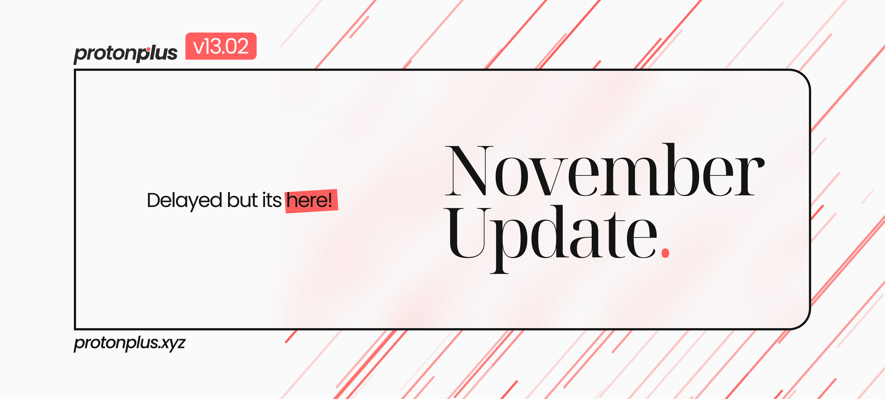

***Konnichiwa Minasan!!*** We hope you all are doing great physically and mentally.

<!--truncate-->

On our last ***[Telegram Post](https://t.me/protonplusupdates/49)***, we discussed the Mid-October Update, which we postponed as our source was not ready, and we have been working since then tirelessly to get it ready. With November Patch being dropped, our source is ready, and this is the most significant update since the inception of ***protonplus 13***.

This update also brings the new visual identity change in our Branding. With this update, we are moving our custom ***protonplus*** version to 13.02. Although we have not gotten any new devices on our roster, Gauguin will be back in production from this update. Every ***[Official Device](https://t.me/protonplusupdates/48)*** will get this update in a few days. 

If you liked the project, then feel free to ***[Donate](https://t.me/YetAnotherAkatsuki/7)***. Your donation can be a Life Saver for our project by helping us maintain our server and infrastructure cost.

Read the Full Source Changelog ***[Here!](https://github.com/protonplus-org/ota/blob/tm/source_changelog/source_changelog.txt)***